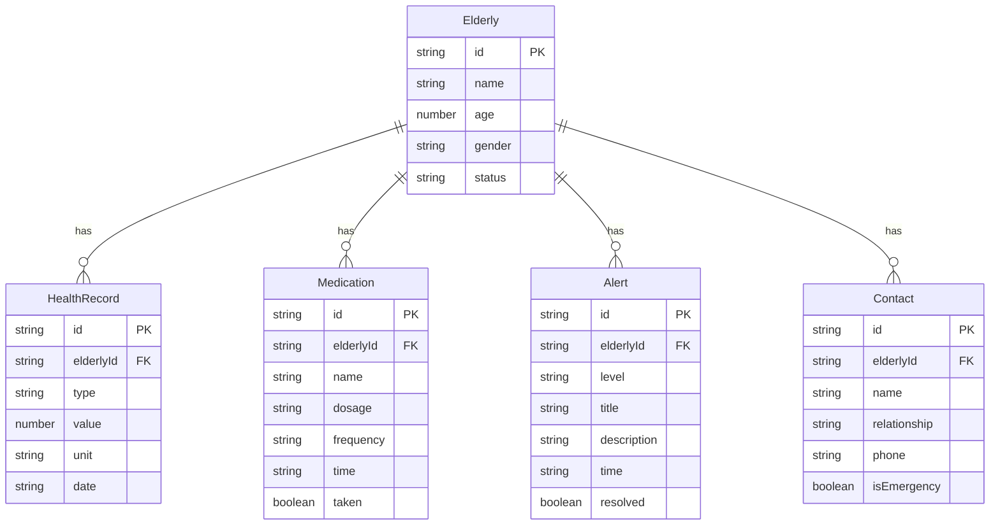

## 1. 架构设计

```mermaid
flowchart TD
    "浏览器客户端" --> "React 前端应用"
    "React 前端应用" --> "React Router 路由层"
    "React 前端应用" --> "Zustand 状态管理"
    "React 前端应用" --> "本地 Mock 数据层"
    "本地 Mock 数据层" --> "模拟健康数据"
    "本地 Mock 数据层" --> "模拟用药数据"
    "本地 Mock 数据层" --> "模拟告警数据"
    "本地 Mock 数据层" --> "模拟联系人数据"
```

## 2. 技术说明

- 前端：React@18 + TypeScript + Tailwind CSS@3 + Vite
- 初始化工具：vite-init（react-ts 模板）
- 后端：无（纯前端项目）
- 数据库：无（使用本地 Mock 数据）
- 状态管理：Zustand
- 路由：React Router DOM v6
- 图表：recharts
- 图标：lucide-react

## 3. 路由定义

| 路由 | 用途 |
|------|------|
| / | 首页概览，展示老人状态摘要和快捷入口 |
| /health | 健康记录，展示各项健康指标趋势和历史数据 |
| /medication | 用药提醒，展示今日用药计划和药物总览 |
| /alerts | 异常告警，展示实时告警和历史告警记录 |
| /contacts | 家属联系人，展示联系人列表和紧急联系信息 |

## 4. API 定义

无后端 API，所有数据通过本地 Mock 数据提供。

## 5. 数据模型

### 5.1 数据模型定义



### 5.2 数据定义

所有数据存储在 `src/data/` 目录下的 TypeScript 文件中，导出类型化的模拟数据数组，供各页面组件直接导入使用。
